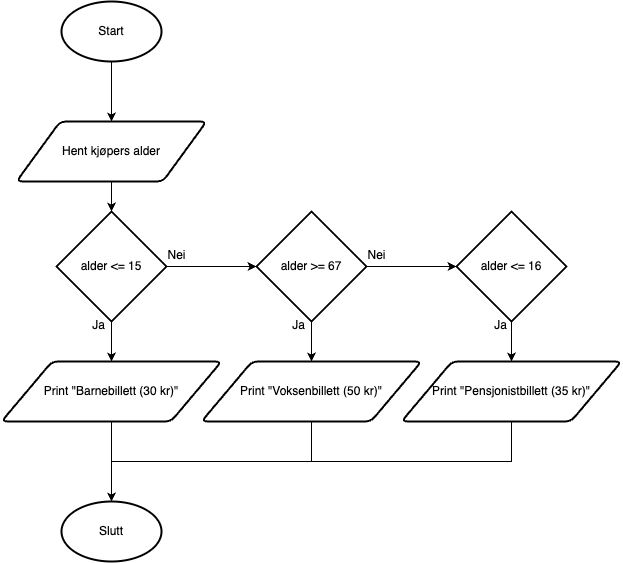

# Oppgaver (kopiert fra fil der oppgavene hadde andre oppgavenavn)

## Oppg. 2.1:
- Svar: C

## Oppg. 2.2:
- Svar: D

## Oppg. 2.3:
- Svar: A & C

## Oppg. 2.4:
```pseudo

FUNCTION trekanttall (n)
  SET tn TO n * (n+1)/2
  RETURN tn
ENDFUNCTION

SET totalsum TO 0
SET i TO 0
FOR hver i LESSER THAN OR EQUAL TO 10
    CALL trekanttall (i) RETURNING nytt trekanttall
    INCREMENT totalsum BY nytt trekanttall
ENDFOR

DISPLAY totalsum
```

## Oppg. 2.5:
- Flytdiagrammet:



## Oppg. 2.6:
- Svar: 4

## Oppg. 2.7:
- Svar: C

## Oppg. 2.8:
- Svar: C
