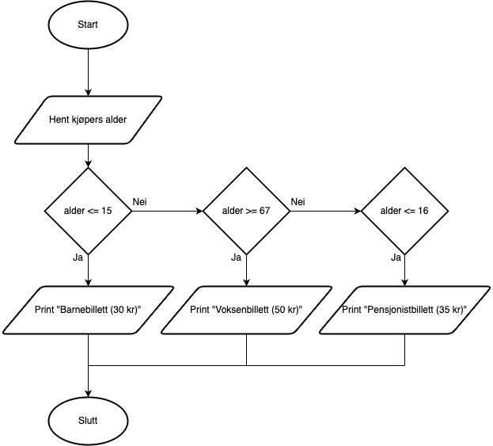

# Oppgaver - Algoritmer, pseudokode og flytdiagram

## Oppg. 1:
- Svar: C

## Oppg. 2:
- Svar: C

## Oppg. 3:
- Svar: C

## Oppg. 4:
- Svar: C

## Oppg. 5:
- Svar: D

## Oppg. 6:
- Svar: 1, 3

## Oppg. 7:
- Flytdiagrammet:



## Oppg. 8:
```pseudo

FUNCTION trekanttall (n)
  SET tn TO n * (n+1)/2
  RETURN tn
ENDFUNCTION

SET totalsum TO 0
SET i TO 0
FOR hver i LESSER THAN OR EQUAL TO 10
    tn = CALL trekanttall (i) """"RETURNING tn""""
    INCREMENT totalsum BY tn
    INCREMENT i
ENDFOR

DISPLAY totalsum

```
